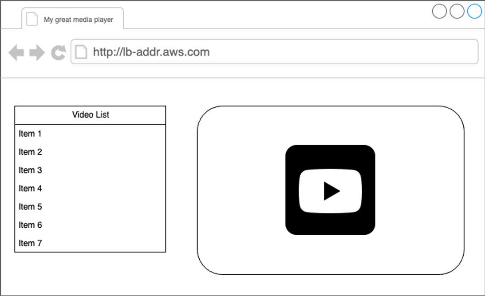

# First Assignment- Media player
In this assignment, we will implement a media player that can scale to millions of users on a cloud platform.

The media player should support a video gallery based on existing Videos, display their names, and start playing the videos when clicking on some of the names.

